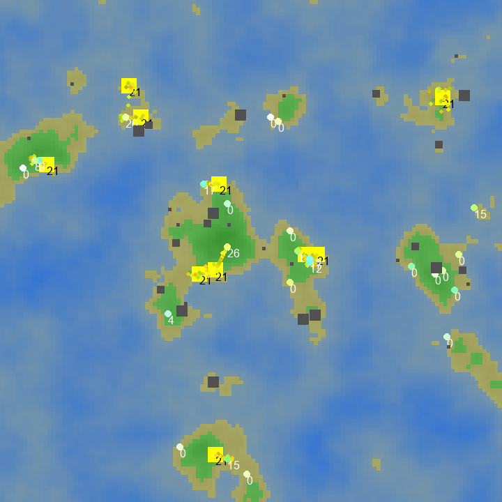

# Untitled Bee Simulation

A 2D top-down bee colony simulator built with Pygame for the COMP1005 Fundamentals of Programming practical assignment. Bees forage for honey, return to their hive, and interact with a procedurally generated world — all driven by emergent flocking behaviour.



---

## Features

### Procedural Terrain
The world is a 128×128 tile grid generated using Perlin noise, producing distinct biomes:
- **Water** — impassable; bees actively avoid flying over it
- **Sand** — transitional coastal tiles
- **Land** — where hives, flowers, and obstacles are placed

Each run uses a random seed, ensuring every map is unique while remaining reproducible.

### Boids Flocking Behaviour
Bee movement is governed by Craig Reynolds' classic Boids algorithm, applied to both the world and the hive interior:
- **Separation** — bees steer away from neighbours that are too close
- **Alignment** — bees match the average velocity of nearby bees
- **Cohesion** — bees steer toward the centre of their local flock

### Hive System
Each hive contains a hexagonal honeycomb grid (12×9 cells). Workers deposit honey into empty cells, and queens lay eggs in dedicated cells. Eggs mature after ~30 hive ticks and hatch into new workers if enough honey is available — dynamically growing the population.

### Energy & Life Cycle
- Every bee has an energy level that decays over time
- Workers restore energy by eating honey inside the hive
- Queens lay eggs and manage the colony's growth
- Dead bees are removed from the simulation; new ones are hatched from the comb

### Interactive Inspection
Click any bee or hive to open a detail panel:
- **Bee panel** — position, velocity, energy, honey carried, role, closest flower
- **Hive panel** — live view of the honeycomb showing honey levels and egg cells

### Live Population Graph
A real-time graph in the top-right corner tracks total bee population across the simulation.

---

## Running the Simulation

### Default mode
```bash
python main.py
```

### With a fixed seed (for reproducible runs)
```bash
python main.py -s 12345
```

### Interactive mode (configure parameters at startup)
```bash
python main.py -i
```
Prompts for: number of bees per hive, initial energy, hive release cooldown, obstacle count, number of hives, queen count, velocity bounds, detection radius, separation threshold, and flower size.

### Batch mode (load map and parameters from CSV files)
```bash
python main.py -b -f map_oasis.csv -p params.csv
python main.py -b -f map_oasis.csv -p params.csv -s 99
```

### Screenshot mode (render one frame and exit)
```bash
python main.py --screenshot output.png -s 42
```

---

## Controls

| Action | Input |
|---|---|
| Pan camera | Move mouse to screen edge |
| Zoom in | `=` or `+` |
| Zoom out | `-` |
| Select bee / hive | Left-click |
| Quit | Close window |

---

## Configuration

### `params.csv`
Key parameters that can be overridden in batch mode:

| Parameter | Default | Description |
|---|---|---|
| `H_INITIAL_WORKERS` | 20 | Worker bees spawned per hive |
| `H_INITIAL_QUEENS` | 1 | Queens spawned per hive |
| `H_BEE_COOLDOWN` | 3 | Frames between releasing bees from the hive |
| `CREATURE_INITIAL_ENERGY` | 50 | Starting energy for each bee |
| `CREATURE_MAX_VELOCITY` | 0.1 | Maximum bee speed |
| `CREATURE_DETECTION_RADIUS` | 2.5 | Radius for flocking neighbour detection |
| `CREATURE_SEPARATION_THRESHOLD` | 0.7 | Distance at which separation force activates |
| `N_OBSTACLES` | 30 | Number of rock obstacles placed on land |
| `MAP_SIZE` | 128 | World grid dimensions (MAP_SIZE × MAP_SIZE) |
| `BG_NOISE_SCALE` | 4 | Perlin noise frequency — higher = more varied terrain |
| `BG_NOISE_OCTAVES` | 8 | Perlin noise detail layers |
| `BG_WATER_THRESHOLD` | ~0.431 | Noise value above which a tile becomes water |
| `SEED` | time-based | Fixed seed for terrain and object placement |

### Map CSV files
A map file is a `MAP_SIZE × MAP_SIZE` grid of float values in `[0, 1]`. Values above `BG_WATER_THRESHOLD` are water; lower values are land. Three example maps are included:

| File | Description |
|---|---|
| `map_oasis.csv` | Landmass with central water features |
| `test_map.csv` | Minimal test layout |
| `random_noise_map.csv` | Pure noise-generated terrain |

---

## Project Structure

```
Bee-Sim/
├── main.py              # All simulation logic
├── params.csv           # Default parameter file for batch mode
├── map_oasis.csv        # Example map
├── test_map.csv         # Test map
├── random_noise_map.csv # Noise-generated map
├── bee.png              # Bee sprite asset
├── flower.png           # Flower sprite asset
├── screenshot.png       # Auto-generated overview screenshot
└── requirements.txt     # Python dependencies
```

---

## Dependencies

```
matplotlib==3.10.3
noise==1.2.2
numpy==2.2.5
pygame==2.6.1
```

Install with:
```bash
pip install -r requirements.txt
```

---

## Version

May 12, 2025 — Final submission for COMP1005 Practical Assignment.
